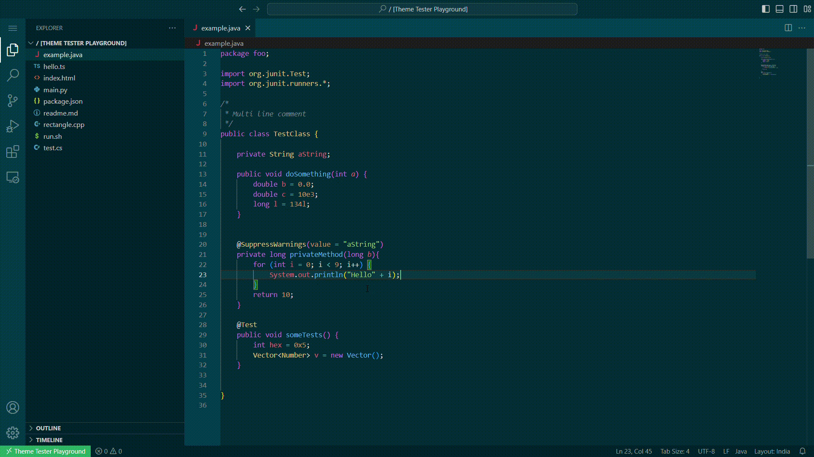
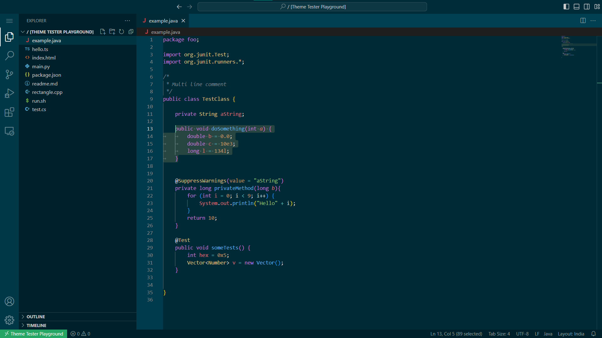
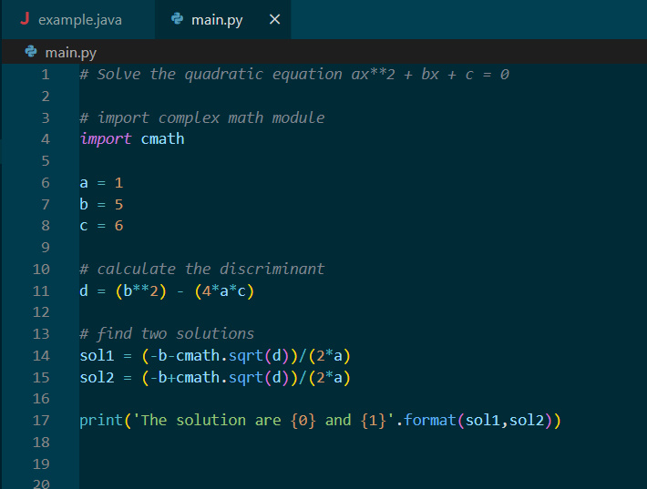
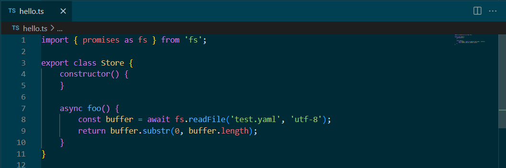
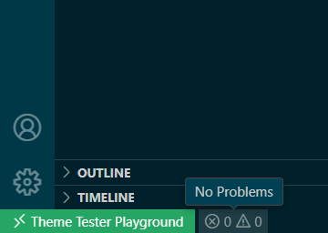
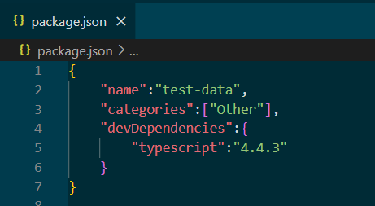
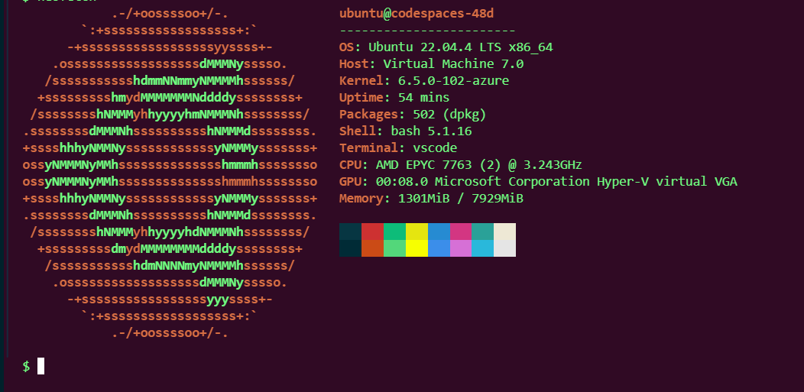

# apcodespaces-theme

This is a customized version inspired from Solar Dark, with better syntax highlighting and colors.

## Installation

Search for	`ap-dev.theme-customs` on the VS Code extensions marketplace to download the theme.

## Preview

### Preview0 

---
### Preview1
Colors for :
+ Selected text hightlight color
+ Java syntax highlighting

---
### Preview2
Colors for : 
+ python syntax highlighting
+ multiple tabs (active/inactive)
+ comments

---
### Preview3
Colors for : 
+ TypeScript syntax highlighting
+ mini-map
+ scrollbar
+ toolbar widgets

---
### Preview4
Colors for :
+ Activity Bar icons
+ Status Bar widgets (hover)
+ Remote Status

---
### Preview5
Colors for :
+ json file color highlighting 
+ active tab color
+ gutter

---
### Preview6
Colors for :
+ Terminal with ubuntu style colors

---

## Contributing

Contributions are welcome! Please feel free to join and contribute to the development of `apcodespaces-theme`.
